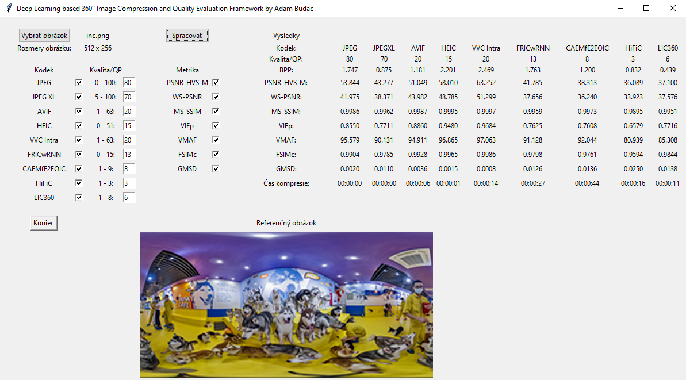

# Deep Learning based 360° Image Compression and Quality Evaluation Framework

## Introduction
This framework is created as a part of diploma thesis. It allows to compress images by conventional codecs such as JPEG, JPEG XL, HEIC, AVIF and VVC Intra and deep learning-based algorithms [Full Resolution Image Compression with Recurrent Neural Networks](https://arxiv.org/abs/1608.05148), [Context-adaptive Entropy Model for End-to-end Optimized Image Compression](https://arxiv.org/abs/1809.10452), [High-Fidelity Generative Image Compression](https://arxiv.org/abs/2006.09965) and [End-to-end optimized 360-degree image compression](https://ieeexplore.ieee.org/document/9904466). All codecs are set to their highest complexity to ensure the maximum compression efficiency. It measures image compression times and calculates image quality based on objective metrics such as PSNR-HVS-M, WS-PSNR, MS-SSIM, VIFp, FSIMc, GMSD and VMAF. It is programmed in Python 3.9 using Tkinter and tested on Windows 10 x64.

## Prerequisities
* [FFmpeg v5.1.2](https://www.gyan.dev/ffmpeg/builds/packages/ffmpeg-5.1.2-full_build.7z)
* JPEG - [libjpeg-turbo v2.1.4 x64](https://sourceforge.net/projects/libjpeg-turbo/files/2.1.4/)
* JPEG XL - [libjxl v0.7.0 x64](https://github.com/libjxl/libjxl/releases/download/v0.7.0/jxl-x64-windows-static.zip)
* HEIC - [HM v17.0 x64](https://vcgit.hhi.fraunhofer.de/jvet/HM/-/archive/HM-17.0/HM-HM-17.0.zip)
* AVIF - [avifenc v0.11.1 x64](https://ci.appveyor.com/api/buildjobs/v39shvobkckxeo8y/artifacts/build%2Favifenc.exe) and [avifenc v0.11.1 x64](https://ci.appveyor.com/api/buildjobs/v39shvobkckxeo8y/artifacts/build%2Favifenc.exe) 
* VVC Intra - [VVenC v1.7.0 x64](https://github.com/fraunhoferhhi/vvenc/archive/refs/tags/v1.7.0.zip) and [VVdeC v1.6.0 x64](https://github.com/fraunhoferhhi/vvdec/archive/refs/tags/v1.6.0.zip)
* Full Resolution Image Compression with Recurrent Neural Networks - [FRICwRNN build 24 Mar 2018](https://github.com/tensorflow/models/tree/archive/research/compression)
* Context-adaptive Entropy Model for End-to-end Optimized Image Compression - [CAEMfE2EOIC v2](https://github.com/JooyoungLeeETRI/CA_Entropy_Model)
* High-Fidelity Generative Image Compression - [HiFiC v0.3](https://github.com/Justin-Tan/high-fidelity-generative-compression)
* End-to-end optimized 360-degree image compression - [LIC360 build 25 Oct 2022](https://github.com/limuhit/360-Image-Compression)
* PSNR-HVS-M, MS-SSIM, VIFp - [VQMT v1.1](https://www.epfl.ch/labs/mmspg/downloads/vqmt/)
* WS-PSNR - [360tools](https://github.com/Samsung/360tools)
* [MATLAB R2022b](https://www.mathworks.com/products/matlab.html)
* [FSIMc](https://web.comp.polyu.edu.hk/cslzhang/IQA/FSIM/Files/FeatureSIM.m)
* [GMSD](http://www4.comp.polyu.edu.hk/~cslzhang/IQA/GMSD/GMSD.m)
* [VMAF v2.3.1](https://github.com/Netflix/vmaf/releases/download/v2.3.1/vmaf.exe)

## Instalation
To ensure full functionality, FFmpeg, all 5 conventional codecs, VQMT, 360tools and VMAF have to be installed in system path in Windows environment variable. In Python environment, matlab.engine R2022b and pillow 9.2.0 libraries needs to be installed. Deep learning-based algorithms have to be installed in C:/ProgramData/Anaconda3/envs/envname/_Github/, where available envnames are: "FRICwRNN", "CAEMfE2EOIC", "HiFiC" or "LIC360". 

## Translation
Because the framework is in Slovak, here is the English translation:
* Vybrať obrázok - Choose image
* Rozmery obrázku - Image resolution
* Kodek - Codec
* Kvalita - Quality
* Metrika - Metric
* Spracovať - Process
* Výsledky - Results
* Čas kompresie - Compression time
* Referenčný obrázok - Reference image
* Koniec - Exit

## Usage
The input image have to be in PNG format. The process of compression and quality evaluation is very simple:
1. Select image
2. Select the codecs that will be used for compression
3. Select compression quality/quantization parameter
4. Select the metrics that will be used for quality evaluation
5. Click the Process (Spracovať) button
6. Wait for the compression, decompression and quality evaluation
7. View the results
8. Close the program

Compressed and decompressed images in PNG format, metric results and generated .bat and .m scripts are available in working directory, where the Framework.py is located.

## GUI
### Before compression

### After compression

## References
1. [Diploma thesis]() - link to be added soon
2. [Quality comparison of 360° 8K images compressed by conventional and deep learning algorithms](https://ieeexplore.ieee.org/document/10109066)
3. [Comparison of compression and decompression speeds for 360° images with resolutions up to 8K using conventional and deep learning algorithms]() - link to be added soon
4. [360° photo](https://www.kandaovr.com/gallery/)